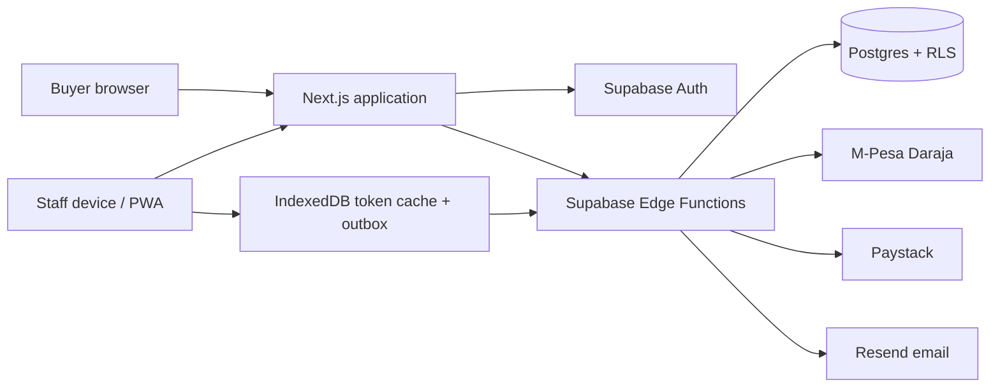

# MeatSoko Ticketing — Technical Documentation

**Document status:** operational reference, reviewed 2026-09-27  
**Application:** MeatSoko standalone event ticketing platform  
**Canonical database deployment source:** ordered files in `supabase/migrations/`

This document describes the checked-in implementation and the linked Supabase environment at the review date. It is not a guarantee that every external dashboard setting is correct; confirm live secrets and provider settings in their respective consoles. Secret values must never be copied into this document.

## 1. System overview

The web application uses Next.js App Router and Supabase. Public pages support event discovery, ticket checkout, RSVP/preorders, ticket recovery, and pass display. Authenticated staff use the scanner, guest list, and gate sale tools. Administrators configure events, inventory, reservations, preorder items, and operational records.



Payment credentials and service-role access remain server-side in Edge Functions. The browser receives hosted checkout links, status data, and bearer pass tokens as required for ticket display. Never add gateway secret keys or the service-role key to `NEXT_PUBLIC_*` variables.

## 2. Technology and repository layout

- **Web:** Next.js 14.2, React 18, TypeScript; Node.js `>=18.17`.
- **Data/auth:** Supabase Postgres, RLS, Supabase Auth, and server-side service-role Edge Function clients.
- **Edge runtime:** Supabase Functions on Deno; shared CORS, auth, rate-limiting, email, and payment helpers live in `supabase/functions/_shared/`.
- **Gate:** `html5-qrcode`, installable PWA shell, IndexedDB token cache and offline redemption outbox.
- **Payments:** M-Pesa Daraja STK push and Paystack hosted checkout. Paystack is supported in code but requires live secret and merchant configuration.
- **Email:** Resend helper in Edge Functions; availability depends on function secrets and a verified sender.

Important paths:

| Path | Purpose |
|---|---|
| `src/app/` | Public, staff, and admin routes |
| `src/components/` | Checkout, reservations, event admin, scanner, and pass UI |
| `src/lib/` | Supabase clients, guards, function invocation, offline storage |
| `supabase/migrations/` | Ordered schema and behavior changes |
| `supabase/functions/` | Payment, reservation, ticket, scan, lookup, and notification APIs |
| `public/` | PWA manifest, service worker, and static assets |
| `REMAINING_WORK.md` | Prioritized launch issues and product opportunities |

## 3. Routes and user areas

| Route | Access | Function |
|---|---|---|
| `/` and `/events` | Public | Event listing and discovery |
| `/e/[slug]` | Public | Event information, ticket checkout, reservation/preorder checkout |
| `/lookup` | Public, rate-limited API | Recover active ticket passes using phone/event details |
| `/t/[token]` | Bearer token | Ticket pass view |
| `/r/[token]` | Bearer token | Reservation pass view |
| `/login` | Public | Staff sign-in |
| `/scan` | Staff | QR scanner, guest list, online/offline admission |
| `/gate` | Staff | Gate sales workflow |
| `/admin` | Admin | Event management |
| `/admin/events/[id]` | Admin | Event settings, inventory, reservations, preorder configuration and reporting |

Middleware refreshes the Supabase session for protected paths. Server pages use `requireStaff` or `requireAdmin`; Edge Functions that perform staff-only actions verify the user JWT and role before using a service-role database client.

## 4. Data model and migrations

The core relational flow is:

```text
events ──< ticket_types
events ──< reservation_types
events ──< preorder_items
events ──< orders ──< order_items >── ticket_types
orders ──< tickets
events ──< reservations ──< reservation_preorders >── preorder_items
reservations / tickets ──< redemptions
admin_users and admin_audit support access and change history
```

The migration history includes rate limiting and inventory availability, RSVP/reservation and preorder support, guest email requirements, duplicate-email protection, admission locking, and Paystack payment/provider fields and confirmation RPC. See the dated migration files for exact DDL and constraints.

**Schema source warning:** `supabase/schema.sql` is a historical bootstrap snapshot and is not aligned with the full migration sequence or current reservation/preorder and Paystack behavior. For an existing project, apply ordered migrations. Do not use the snapshot as a production restore/bootstrap until it has been reconciled and reviewed.

Amounts are represented as KES in the application/database. Paystack initialization and verification use the provider's smallest currency unit and compare the verified transaction amount with the server-calculated order amount. Client-supplied totals are not authoritative.

## 5. Authentication, authorization, and privacy boundaries

- RLS is enabled on application tables. Public catalog policies expose live event data and active ticket/reservation/preorder options; staff and admin policies rely on role checks.
- Financial, ticket-holder, reservation, and redemption records are staff-readable; mutations that need privileged access happen in guarded Edge Functions or admin server paths.
- `redeem` and `sync-tokens` require a staff JWT. They verify the identity and staff membership, then use a clean service-role client for the narrow privileged operation.
- Public recovery and payment functions are rate-limited where they reveal information or create payment attempts.
- Public ticket and reservation passes are bearer credentials: anyone holding a valid token can view/act on the corresponding pass flow. Treat QR values and access URLs as sensitive.
- **Open high-priority finding:** `order-status` accepts an M-Pesa checkout request ID and returns QR tokens when that order is paid. Those QR values authorize admission. Replace this response contract with status-only polling and scoped buyer recovery before accepting real ticket payments; see `REMAINING_WORK.md`.
- Confirm Postgres function grants as well as RLS policies when changing RPCs. The migration `20260924140000_lock_admit_pass.sql` tightened admission RPC execution.

## 6. Payment and fulfillment flows

### Ticket checkout

1. The browser submits event, ticket type IDs, quantities, phone, email, and provider to `stk-push`.
2. The function validates the event and active ticket types, resolves prices from Postgres, checks capacity including pending orders, and creates/reuses a pending order.
3. For **M-Pesa**, the function starts Daraja STK push and stores the checkout request ID. `daraja-callback` validates/correlates the callback and invokes the idempotent payment confirmation RPC.
4. For **Paystack**, `stk-push` initializes hosted checkout with amount in subunits, KES currency, a generated reference, and an event return URL. The browser redirects to the hosted page.
5. On return, `paystack-verify` asks Paystack's API to verify the reference, then checks success, reference, currency, and amount server-side. `paystack-webhook` processes `charge.success` by running the same verification path. `confirm_paystack_payment` ensures confirmation/issuance is idempotent.
6. Paid orders produce ticket records and, when configured, ticket email. Admin reporting and buyer status polling reflect the result.

The Paystack webhook URL for the linked project is:

```text
https://tyirenanflcmwfywurvk.supabase.co/functions/v1/paystack-webhook
```

At review time the function code and deployment were in place, but the linked project did not have `PAYSTACK_SECRET_KEY`; no real Paystack transaction could initialize until that secret is configured. Verify provider dashboard delivery and KES availability before production use.

### Reservations and preorders

1. `reserve` validates live event settings, reservation type, party size, optional preorder items, and server-side prices/capacity.
2. A free RSVP creates a reservation/pass directly. A paid preorder creates a pending order and reservation relationship and initializes the selected payment provider.
3. Paystack return or webhook uses the same verify-and-confirm helper and reservation-aware confirmation RPC. Successful confirmation issues the reservation access pass and attempts email delivery.
4. Reservation pass display is through `/r/[token]`; `reservation-status`, `reservation-by-token`, and `reservation-lookup` support checkout completion and recovery.
5. Gate redemption rejects a preorder reservation while its linked order is unpaid. Offline sync also marks it `paid: false` so the scanner blocks admission.

In the linked database, NyamaFest (`nyamafest`) was configured with payments enabled and had active preorder items at the audit date. This is an environment state, not a default for other events. Verify the event's event settings and item inventory before live use.

## 7. Edge Function reference

Public functions below are configured without Supabase gateway JWT enforcement because they serve buyer/provider requests; each still performs its own validation and, where needed, provider verification/rate limiting. Staff functions require JWT and role validation.

| Function | Caller | Responsibility |
|---|---|---|
| `stk-push` | Buyer/staff gate | Validates order and starts M-Pesa or Paystack ticket payment |
| `daraja-callback` | Safaricom | Correlates and confirms M-Pesa payment callback |
| `order-status` | Buyer/gate client | Polls order status; currently has the QR-token exposure described above |
| `paystack-verify` | Buyer browser | Server-verifies a Paystack reference and confirms fulfillment |
| `paystack-webhook` | Paystack | Handles successful payment notification through provider verification |
| `reserve` | Buyer | Creates RSVP/preorder and initializes payment when needed |
| `reservation-status` | Buyer | Polls reservation/preorder checkout state |
| `reservation-by-token` | Buyer | Reads reservation pass information by bearer token |
| `reservation-lookup` | Buyer | Recovers reservations using submitted contact details |
| `lookup` | Buyer | Recovers active tickets; rate-limited |
| `ticket-by-token` | Buyer | Reads ticket pass data by bearer token |
| `redeem` | Staff | Admits one or more ticket/reservation passes |
| `sync-tokens` | Staff | Loads active event passes and states for offline cache |

See each `index.ts` and `supabase/config.toml` for exact request fields and JWT gateway settings. Shared utilities are in `_shared/`.

## 8. Scanner and offline operation

The scanner normalizes a QR URL/token, then calls `redeem` while online. The server RPC handles both tickets and reservations, records station and staff identity, and prevents duplicate redemption. When offline, the scanner validates against the last IndexedDB token snapshot, blocks known unpaid/refunded/redeemed passes, queues admission in an outbox, and reconciles the queue when connectivity returns. A pass admitted offline can still be rejected during reconciliation if another gate admitted it first or the pass was refunded; staff must resolve that discrepancy.

**Operational limitation:** run `Sync cache` before doors open and keep devices online for initial sync. The current client stores the cache scope as the literal `live` and does not pass an event ID to `sync-tokens`; the function supports event filtering. Correct event scoping before relying on multiple simultaneous live events.

## 9. Environment and secrets

Use `.env.example` as the variable-name reference. Configure browser-safe values in the hosting platform and server values as Supabase Function secrets. Never commit `.env`, `.env.local`, `.env.supabase`, access tokens, or credentials.

| Variable | Location/use |
|---|---|
| `NEXT_PUBLIC_SUPABASE_URL` | Browser/server Supabase project URL |
| `NEXT_PUBLIC_SUPABASE_ANON_KEY` | Browser-safe Supabase anon key |
| `NEXT_PUBLIC_APP_URL` | Web app origin used by client-side links/configuration |
| `SUPABASE_URL` | Edge Function project URL |
| `SUPABASE_SERVICE_ROLE_KEY` | Edge Functions only; privileged database access |
| `APP_URL` | Edge Function pass/email and payment return links |
| `PAYSTACK_SECRET_KEY` | Edge Functions only; Paystack API authorization |
| `DARAJA_*` | Edge Functions only; M-Pesa credentials and callback configuration |
| `RESEND_API_KEY`, `TICKET_EMAIL_FROM` | Edge Function email delivery |
| `WHATSAPP_WEBHOOK_URL` | Referenced by event notification configuration; provider path needs verification/implementation |

Check `.env.example` and `_shared/` for the exact current Daraja names. The deployed CLI secret listing confirms presence only; do not infer or publish secret values from digests.

## 10. Local setup and deployment

```sh
npm install
cp .env.example .env.local
# Set the public Supabase URL and anon key for local web development.
npm run dev
```

For a connected Supabase project, link the intended project, apply ordered migrations, set Edge Function secrets, and deploy the functions. Example:

```sh
supabase link --project-ref YOUR_PROJECT_REF
supabase db push
supabase secrets set --env-file .env.supabase
supabase functions deploy stk-push
supabase functions deploy daraja-callback
supabase functions deploy order-status
supabase functions deploy paystack-verify
supabase functions deploy paystack-webhook
supabase functions deploy reserve
supabase functions deploy reservation-status
supabase functions deploy reservation-by-token
supabase functions deploy reservation-lookup
supabase functions deploy lookup
supabase functions deploy ticket-by-token
supabase functions deploy redeem
supabase functions deploy sync-tokens
```

Deploy the Next.js application through the hosting provider configured for this repository. A Git push alone may not deploy the web app unless the provider's repository integration is connected. After deployments, verify environment values, Edge Function logs, webhook delivery, email sender, and a controlled payment. Do not run live payment tests without explicit merchant readiness and monitoring.

## 11. Operational references

- [Remaining work and launch blockers](REMAINING_WORK.md)
- [Admin access and staff account procedure](ADMIN_ACCESS.md)
- [Daraja production provisioning](DARAJA_PRODUCTION.md)
- [Launch checklist](LAUNCH_CHECKLIST.md) — historical checklist; some statements are stale and must be revalidated.

For an incident, capture the order ID/reference, event, timestamp, payment provider, function request ID, and provider transaction reference. Never send secret keys, full bearer QR tokens, or unredacted customer data in logs or support channels.

## 12. Audit and Ticketyetu feature review

### Verified implementation findings

- The repository includes ticketed checkout, free reservations, paid preorders, role-guarded staff/admin areas, ticket/reservation lookup, online/offline scanning, and M-Pesa plus Paystack code paths.
- The linked Supabase database had RLS policies on the inspected event, inventory, order, ticket, reservation, redemption, and audit tables. Privileged scan and payment operations are routed through Edge Functions/RPCs.
- Paystack database migration and payment functions were applied/deployed at the review date; the payment secret remained missing. Successful production payment behavior remains unverified.
- `order-status` returns QR bearer tokens on the M-Pesa checkout ID path (P0 above).
- Offline sync does not persist the actual event scope (P1 above).
- The migration sequence is newer and more complete than `supabase/schema.sql` (P1 above).
- No automated payment/scanner regression suite was run as part of this documentation review.

### Public-site observations

The public Ticketyetu site presents event/artist/venue search, city/date filters, featured/trending and category discovery, and rich event pages with overview, lineup, venue, and seat-layout sections. Its public contact and terms pages describe buyer help for receipt/payment problems, order references, one-entry tickets, cancellation/refund responsibilities, and organizer support. These are observations of public-facing pages; account-only and back-office behavior was not inspected.

- [Ticketyetu homepage and event discovery](https://ticketyetu.com/)
- [Example event page with lineup and seat-layout sections](https://ticketyetu.com/events/one-night-only-brunch-edition-w6flbQ)
- [Ticketyetu contact and buyer support](https://ticketyetu.com/contact)
- [Ticketyetu terms](https://ticketyetu.com/terms)
- [Ticketyetu privacy policy](https://ticketyetu.com/privacy-policy)

The product recommendations in `REMAINING_WORK.md` adapt these visible patterns to this project's current data and operations: buyer payment recovery, audit-friendly refunds/reconciliation, richer event pages, city/date/category discovery, optional seating, organizer tools, and buyer communication preferences. Treat them as proposals for product validation, not as implementation commitments or verified Ticketyetu backend capabilities.

## 13. Traps and failure drills

Carried over from the retired `FOLDER_GUIDE.md`.

### Edge function auth — the one thing not to get wrong

`redeem` and `sync-tokens` need the caller's identity **and** service-role database
access. Do not do this:

```ts
// WRONG — PostgREST resolves the role from the JWT, not the service key, so RLS applies
createClient(url, SERVICE_ROLE_KEY, { global: { headers: { Authorization: userJwt } } })
```

`redemptions` intentionally has no INSERT policy (NFR-4), so the write above fails with
*"new row violates row-level security policy"* and **every gate scan is rejected**. Use
`requireStaff(req)` from `_shared/supabase.ts`: it verifies the token explicitly via
`auth.getUser(token)` and hands back a clean service-role client.

### CORS — the other thing not to get wrong

`supabase-js` sends `apikey` and `x-client-info` on **every** `functions.invoke()` call.
Any header missing from `Access-Control-Allow-Headers` makes the browser reject the
preflight and never send the real request. The symptom is deeply misleading:

- the browser shows only a generic failure (the `fetch` never completed);
- the function logs show a **successful boot followed by EarlyDrop with no application
  logs** — that is the isolate answering the `OPTIONS` and exiting. The `POST` never ran;
- nothing is written to the database and no rate-limit bucket moves;
- `curl` works perfectly, because curl does not preflight.

Keep `_shared/cors.ts` as the single source of allowed headers, and reply to `OPTIONS`
with `preflight()` from that module.

Relatedly, on the client: `functions.invoke()` sets `data: null` for any non-2xx response
and puts the `Response` on `error.context`. Reading only `data` throws away the server's
error code, collapsing throttles, sold-out types and Daraja rejections into one generic
message. Use `invokeFn()` from `src/lib/invoke.ts`, which always returns the parsed body.

### SRS failure drills — how to simulate them

| SRS §5.4 failure | How to simulate |
|---|---|
| Duplicate Daraja callback | Re-send the same callback payload twice to daraja-callback (curl); expect one `confirmed`, one `already` |
| STK timeout/cancel | Cancel the prompt on the phone; order → `failed`, retry works |
| Offline scan | Load scanner, sync cache, enable airplane mode: admit a valid ticket (queues), rescan same code (rejected from cache), disable airplane mode → outbox syncs, rescan → `already_redeemed` with first timestamp |
| Cap exceeded | Set cap=1, buy 2 bundles in two orders; second payment → order `flagged`, dashboard shows it |
